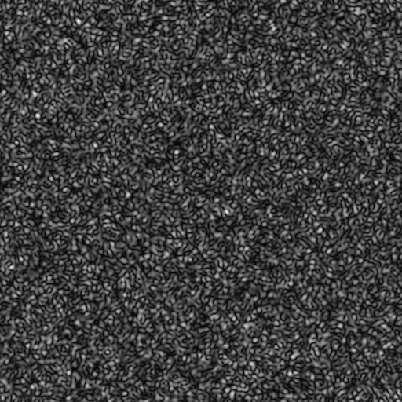
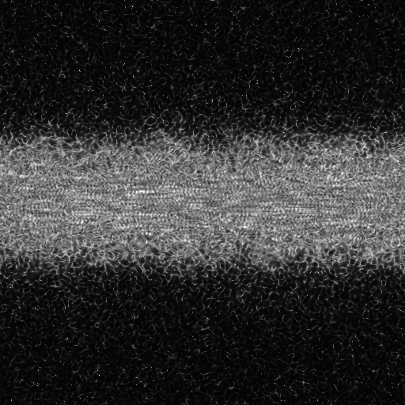
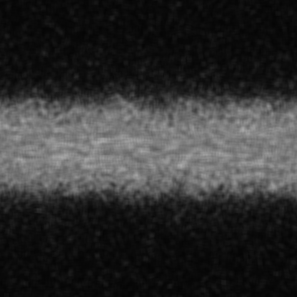
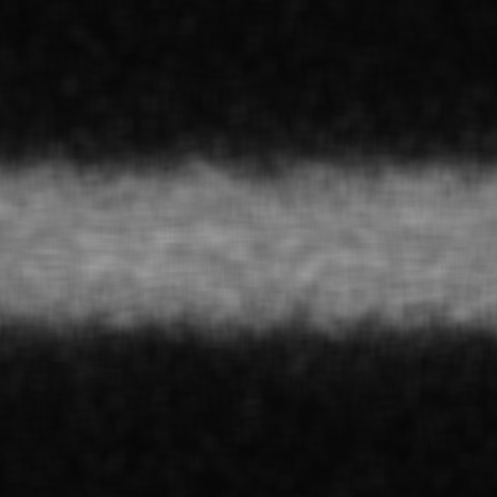
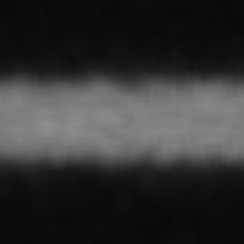

[](https://go.dev)
[](https://github.com/mascotmascot1/go-tlasca/releases/latest)
[](https://opensource.org/licenses/MIT)

# go-tlasca 

**go-tlasca** — это реализация алгоритма *Temporal Laser Speckle Contrast Analysis (tLASCA)* на языке Go с возможностью дополнительного пространственного усреднения.

Классический tLASCA — это метод анализа временного лазерного спекл-контраста. Он используется для оценки динамики движения частиц (например, эритроцитов в сосудах) по изменениям интенсивности рассеянного света во времени. Программа принимает на вход серию последовательных кадров (изображений спекл-паттерна), анализирует, как меняется яркость каждого пикселя во времени, и строит карту контраста.
На итоговой карте яркость пикселя отражает степень изменчивости интенсивности:
— **светлые области** — зоны с выраженными флуктуациями (где сигнал сильно менялся, то есть происходило движение);
— **тёмные области** — стабильные зоны без значительных изменений.

В основе метода лежит простая, но точная статистическая идея. Для каждого пикселя (x, y) по всем кадрам вычисляется:

* **среднее значение яркости** за время (обозначается `μ`, греческая «мю»);
* **стандартное отклонение** яркости (обозначается `σ`, греческая «сигма»).
  Контраст для этого пикселя определяется как отношение `σ/μ` (стандартное отклонение к среднему значению). Чем больше отношение, тем сильнее во времени колеблется интенсивность света в этой точке — то есть выше динамическая активность.

---

## 🧮 Математическая основа

Среднее значение интенсивности (яркости) пикселя по времени:

$$
\bar{I} = \frac{1}{N} \sum_{i=1}^{N} I_i
$$

где $I_i$ — интенсивность пикселя в момент времени $i$, а $N$ — общее число кадров.

Выборочная дисперсия:

$$
s^2 = \frac{1}{N - 1} \sum_{i=1}^{N} (I_i - \bar{I})^2
$$

Стандартное отклонение:

$$
\sigma = \sqrt{s^2}
$$

Контраст (tLASCA):

$$
C = \frac{\sigma}{\bar{I}}
$$

Альтернативная форма через сумму:

$$
C = \frac{1}{\bar{I}} \sqrt{\frac{1}{N - 1} \sum_{i=1}^{N} (I_i - \bar{I})^2}
$$

---

## 🧩 Расширение относительно классического tLASCA

В стандартной реализации tLASCA контраст вычисляется **по каждому пикселю отдельно**, без пространственного усреднения.
В данной программе добавлена возможность **пространственного усреднения** по скользящему окну размером `window_size × window_size`. Этот параметр задаётся в конфигурационном файле. Он нужен для того, чтобы сгладить результат и снизить влияние случайных шумов — программа не ограничивается анализом отдельного пикселя, а учитывает его окружение.

Если `window_size = 1`, усреднение не выполняется, и расчёт полностью соответствует классическому алгоритму tLASCA.
Если `window_size` больше 1 (например, 8, 16 или 32), программа для каждой позиции окна вычисляет контраст во всех пикселях этого окна и затем берёт **среднее значение контраста** по окну. Таким образом, чем больше окно, тем более «плавной» получается итоговая карта, но тем дольше идёт обработка, так как вычислений становится значительно больше.

Чтобы компенсировать рост вычислительной нагрузки при больших окнах, программа выполняет все расчёты **параллельно**, используя все доступные логические ядра процессора. Изображение делится на горизонтальные полосы, каждая из которых обрабатывается отдельной горутиной. Это позволяет сохранять высокую скорость работы даже при увеличении размера скользящего окна.

---

## ⚙️ Конфигурация

Все параметры задаются в файле `go-tlasca.json`.
Пример стандартного конфига:

```json
{
    "paths": {
        "data_dir": "data",
        "results_dir": "results",
        "output_filename": "result.png"
    },
    "algorithm": {
        "window_size": 1
    }
}
```

Если файл **`go-tlasca.json`** отсутствует в директории рядом с исполняемым файлом,
программа **не завершится с ошибкой** — она автоматически создаст конфигурацию **со значениями по умолчанию**, определёнными в [`/internal/config/config.go`](internal/config/config.go) и выведет предупреждение в лог:

```
warn: config file 'go-tlasca.json' not found, using default settings.
```

### Пояснение параметров

**`data_dir`** — путь к директории с входными изображениями. Программа будет искать в ней все файлы формата `*.png`.
Важно: поддерживается **только PNG**, так как этот формат не использует потерь при сжатии, в отличие от JPEG, что критично для точного анализа интенсивности.

**`results_dir`** — путь, куда сохраняется финальное изображение с картой контраста.

**`output_filename`** — имя выходного PNG-файла, например `result.png`.

**`window_size`** — размер квадратного окна усреднения (в пикселях).
Если указано `1`, программа не выполняет пространственное усреднение и анализирует только временные изменения каждого пикселя.
Большие значения (например, 8, 16, 32) позволяют учитывать соседние пиксели и сглаживать результат, но увеличивают время вычислений.

---

## 📂 Требования к входным данным

* Все входные изображения должны находиться в директории, указанной в параметре `data_dir` (по умолчанию — `data`).
* Поддерживаются **только PNG**-файлы без сжатия с потерями.
* Имена файлов должны состоять **только из числовых значений** (`1.png`, `2.png`, …).
  Это необходимо, чтобы программа могла корректно выстроить временную последовательность.
  Любое отклонение от этого формата (например, `frame_1.png` или `imageA.png`) приведёт к ошибке сортировки.

---

## ▶️ Использование

1. Подготовьте папку **`data/`** (параметр `data_dir`) с последовательными кадрами формата **PNG**
   (например: `1.png`, `2.png`, `3.png`, …).

2. Убедитесь, что рядом с исполняемым файлом (или в корне проекта)
   находится файл **`go-tlasca.json`** с нужными настройками.
   Если файла нет — будут использованы параметры по умолчанию (см. выше).

3. Запустите программу одним из способов:

   * **Из исходников (через Go):**

     ```bash
     go run ./cmd/tlasca/
     ```
   * **После компиляции:**

     ```bash
     # For Windows
     go build -o go-tlasca.exe ./cmd/tlasca/
     ./go-tlasca.exe

     # For Linux/macOS
     go build -o go-tlasca ./cmd/tlasca/
     ./go-tlasca
     ```
   * **(Опционально)** если вы используете готовый релиз, просто
     запустите бинарный файл `go-tlasca` в одной директории с `go-tlasca.json`.

4. После выполнения работы результат появится в указанной папке `results/`,
   обычно под именем `result.png`.

---

## 🖼️ Примеры данных и результатов

Для демонстрации работы алгоритма в репозитории уже включён пример тестового набора изображений.
Все входные данные находятся в директории:

```
/data/
```

и представляют собой серию кадров:

```
1.png
2.png
3.png
...
10.png
```

Эти изображения были предоставлены для тестирования и использовались исключительно в учебных целях — они представляют собой модельные спекл-паттерны, имитирующие движение в сосудистой структуре.
Исходное происхождение кадров (аппаратура, объект съёмки и т.д.) не уточняется, но они подходят для корректной демонстрации принципа работы алгоритма.

**Пример исходного кадра:**

<p align="center">
  
</p>

---

## 🧾 Пример результатов

Результаты вычислений сохраняются в директорию:

```
/results/
```

Ниже приведены примеры карт контраста, рассчитанных при разных размерах окна усреднения (`window_size`):

<div align="center">

| `window_size = 1` | `window_size = 8` |
|--------------------|-------------------|
|  |  |

| `window_size = 16` | `window_size = 32` |
|---------------------|--------------------|
|  |  |

</div>

**Интерпретация:**
Светлая полоса в центре — это область с выраженными флуктуациями (там яркость заметно менялась от кадра к кадру). А тёмные зоны — более стабильные области, где изменения были минимальными.

---

## ⚠️ Известные ограничения и замечания

1. **Обработка большого числа изображений:**
   В текущей реализации программа загружает *всю последовательность кадров в память одновременно*.
   Это означает, что при большом количестве изображений (например, тысяча кадров) в процессе будут одновременно открыты сотни файловых дескрипторов.
   На практике это не критично для обычных тестов и небольших наборов данных, но при серьёзных объёмах возможны:

   * повышенное потребление оперативной памяти;
   * достижение системного лимита открытых файлов.

   В будущем можно улучшить реализацию, чтобы использовать, например, **поточную загрузку** кадров (streaming), но проверить это корректно без большого набора данных невозможно.
   Поэтому текущее решение оставлено в простейшем, но надёжном виде.

2. **Поддержка форматов:**
   На данный момент поддерживаются только файлы **PNG**, так как этот формат не теряет информацию о яркости при сжатии.
   Использование JPEG приведёт к искажению статистики контраста.

3. **Требования к именам файлов:**
   Названия файлов должны быть строго числовыми (`1.png`, `2.png`, …), без префиксов и суффиксов.
   Любое отклонение вызовет ошибку сортировки.

---

## 📜 Лицензия

Этот проект распространяется по лицензии **MIT**.  
Подробности см. в файле [`LICENSE`](./LICENSE).

---

